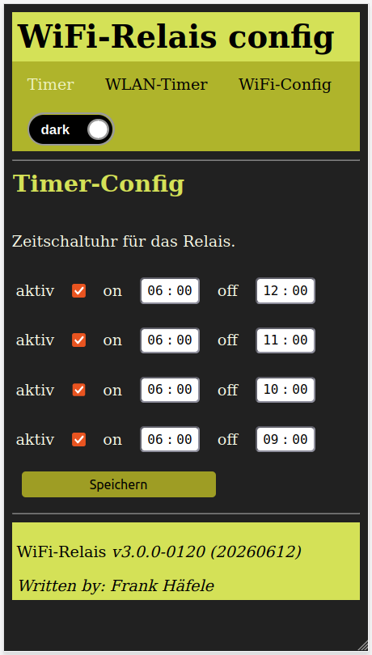

# ESP8266-01-Wifi-Time-Switch-Installer
Web based installer for the ESP8266/01 wifi time switch. 
Application can be installed under an ESP-01 or each ESP8266.

This is based on the official [ESP Web Tools](https://esphome.github.io/esp-web-tools/).

## Contents
* [How to Use This Project](#how-to-use-this-project)
* [Usage of the Web Tools Application](#flash-time-switch-application)
  * [Flash the ESP](#flash-hells-gate-application)
  * [Flash Procedure](#flash-procedure)
  * [First Boot](#first-boot)
* [Pin Configuration](#pins--gpios-which-are-used)
* [Version decoding](#version-decoding)
* [License](#license)
* [Helpful Links](#helpful-links)

## How to use this Project
This project can typically used as time switch which can be adjusted via browser.

The ESP can hold 4 timers for relais actuation in basic version or 8 timers in enhanced version.

## Installation via ESP Web Tools Application
The installation is pretty simple.
You click on the link in the chapter [Web-Installer](#flash-time-switch-application) below, then you will be redirected to my web site were the ESP Web Tools will flash your ESP via browser.

## Flash Time Switch Application

[Web-Installer](https://hasenradball.github.io/ESP8266-01-Wifi-Time-Switch-Installer/)

### Flash Procedure
1) Press connect button

2) select serial port or device

3) select binary to flash, if multiple available

### First Boot
After the flash procedure restart the ESP. Then the ESP will open an access point named `ESP8266-01-Wifi-Config`

1) connect to this access-point
2) load the web site `http://192.168.4.1`
3) You should see input fields
   
   a) Set a hostname e.g.: `timeswitch`

   b) enter `SSID` and `password`

   c) click `ok`
   
   d) chip will reboot.
4) the Application will be available at `http://timeswitch`

## Pins / GPIOs which are used
| PIN     | Biasing   | usage       |
| ------  | --------  | -----       |
| GPIO 0  | PullUp    | SDA for I2C |
| GPIO 1  | PullUp    | TX          |
| GPIO 2  | PullUP    | SCL for I2C |
| GPIO 3  | PullDown  | Relais activation |

## Version decoding
In the footer the version is printed as e.g.: `v1.2.0 - ABCD`.
The four letters represent numbers which are explained below:

### A - decode websocket usage
| number | usage                                         |
| ------ | --------------------------------------------- |
| 0      | use simple http request, no websocket used  |
| 1      | use websocket server                          |

### B - decode GPIO 3/RX pin usage for relais
| number | usage                            |
| ------ | -------------------------------- |
| 0      | Pin 3 not used for relais switch |
| 1      | switch relais by GPIO pin 3/RX   |

### C - decode additional hardware used
| number | usage                        |
| ------ | ---------------------------- |
| 0      | no additional hardware used  |
| 1      | PCF8574 GPIO expander used   |
| 2      | MCP23008 GPIO expander used  |

### D - decode additional sensor used
| number | usage                           |
| ------ | ------------------------------- |
| 0      | no additional sensor used       |
| 1      | DS18x20 temperature sensor used |
| 2      | AM2302 sensor used              |
| 3      | Bosch BME280 sensor used        |

# License
This library is licensed under MIT [License](https://github.com/hasenradball/ESP8266-01-Wifi-Time-Switch-Installer/blob/main/LICENSE)

# Helpful Links
* [ESP8266-01-Adapter](https://esp8266-01-adapter.de)
* [ESP-01-Toröffner](https://esp8266-01-adapter.de/esp8266-01-esp-01-toroeffner/)
